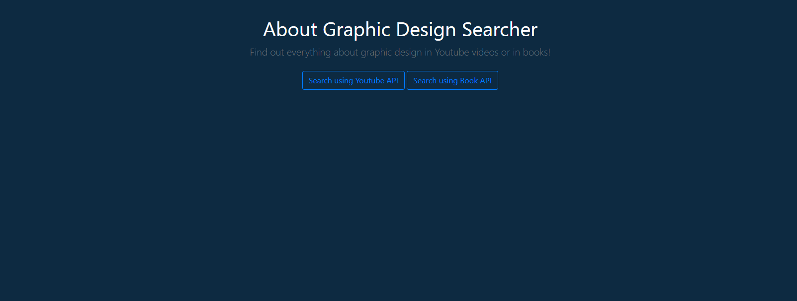
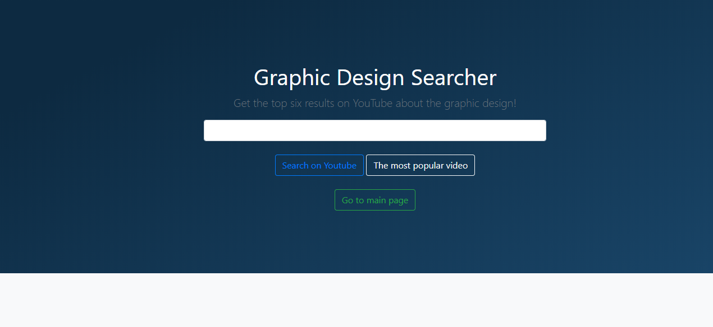

# Aplicatie de acces rapid la materiale necesare invatarii 
# design-ului grafic

## Introducere

Cu totii stim faptul ca internetul este o resura nelimitata, ce ne furnizeaza acces rapid la date. Integrarea de API-uri in aplicatiile dezvoltate de developeri pot aduce laolalta extrem de multe posibilitati prin care userul sa poata accesa informatia astfel incat sa gaseasca raspuns pentru orice intrebare ar avea.

Aplicatia dezvoltata este realizata in Python folosind pe partea de server Flask. 
Flask reprezinta un micro framework scris in limbajul Python, ce este utilizat pentru dezvolatrea aplicatiilor Web. Termenul de „micro” nu sugereaza faptul ca intreaga aplicatie trebuie construita intr-un singur fisier Python si nici lipsa de functionalitati de care dispune Flask. Acest termen, in structura „microframework” contureaza ideea de mentinere a unui cod simplu, dar extensibil. Flask include o gama variata de extensii ce pot fi implementate in cadrul proiectului dand astfel posibilitatea utilizatorului de a lua decizii asupra pachetelor pe care doreste sa le includa in cadrul aplicatiei.
Flask detine un numar mare de valori de configurare, in mod implicit, iar prin conventie, sabloanele si fisierele statice sunt stocate in subdirectoare in aplicatia Python cu denumirea de „templates”, respectiv „static”.

## Descriere problemă 

Aplicatia dezvoltata de mine are ca scop accesul rapid la informatii din sfera design-ului grafic, astfel incat toti cei pasionati de arta si grafica pot gasi aici, consultand atat Youtube-ul, cat si Google Books, cele mai populare informatii si accesate de utilizatori. Aplicatia isi propune imbinarea celor doua servicii (Youtube si Google Books) prin utilizarea API-urilor dezvoltate de Google.

## Descriere API

Cele doua API-uri folosite in aplicatia web sunt:
 - Youtube Data API
 
Acest API permite folosirea diverselor functii ale Youtube-ului. Acest API poate sa fie folosit pentru a incarca video-uri, pentru a cauta video-uri, pentru a utiliza playlist-uri sau pentru a realiza update-uri pentru setarile canalului. Acest API poate sa fie folosit pentru a cauta video-uri dupa un termen, topic, locatie sau alte date. De asemenea, acest API se foloseste de metoda search.list ceea ce face posibilia cautarea de video-uri, playlist-uri si canale.
 
Pentru a putea accesa API-ul de la Youtube, din site-ul API Console selectez optiunea Enable pentru a genera un API_KEY pe care apoi mi-l definesc in aplicatie.

Din cadrul API-ului am folosit resursele:
      - **Search**: care contine informatiile despre vide-urile, canalele si playlist-urile de pe Youtube care sunt conform parametrului specificat intr-un request API. Cat timp cautarea unui rezultat este o resursa unica, precum un video, nu este nevoie de date persistente. Datele sunt preluate sub forma unui JSON, pe care l-am parsat in aplicatie si am extras doar id-ul, titlul (snippet.title), thumbnail-ul (snippet.thumbnails), durata video-ului si link-ul de acces la acesta.
      - **Video** - list: prin care se returneaza o lista de video-uri in urma request-ului cu parametri care API
      
 - Google Books API

## Flux de date

1. Exemple de request / response
    Request pentru Youtube API:
  
       
    Response pentru Youtube API:
    
    
    Request pentru Google Book API:
  
       
    Response pentru Google Book API:
    
2. Metode HTTP
    Metodele folosite in cadul aplicatiei sunt **GET** si **POST**.
    Metoda **POST** este folosita pentru a trimite date catre server. In cazul aplicatiei dezvoltate, prin POST se trimit date catre key-ul specificat pentru accesarea API-ului (YOUTUBE_API_KEY/BOOK_API_KEY) precum si un termen marcat prin "q" (query) in aplicatie, dar si numarul maxim de rezultate pe care le asteptam. 
    Apoi, folosind metoda **GET**, am citit datele preluate de la sursa specifiata din API (Youtube/Google Books). Aceste date sunt sub forma unui JSON care a fost parsat, iar datele au fost apoi afisate in interfata aplicatiei web.
    Folosire metoda GET: r=requests.get(search_url, params=search_params)
    Parsare rezultat: de results=r.json()['items']

3. Autentificare și autorizare servicii utilizate
    Utilizarea API-urilor Youtube si Google Books a fost posibila prin obtinerea unui API KEY de la Google pentru a putea avea acces la cele doua servicii. 
    Mai apoi, pentru a face deploy aplicatiei, am folosit 2 Cloud-uri: Heroku si Azure, in cadrul carora mi-am facut cont. Deploy-ul pe Azure s-a realizat prin mediul in care am scris code, Visual Studio Code, iar pentru Heroku, deploy-ul s-a relizat din GitHub. Pentru a putea avea acces la API pe aceste doua Cloud-uri a fost nevoie sa declar KEY-ul in sectiunea de configurare a variabilelor pentru cele doua medii.

## Capturi ecran aplicație 

Aplicatia se deschide cu pagina principala din care se poate naviga in alte 2 pagini: pagina in care se foloseste API-ul Youtube si in cea in care se afiseaza date preluate folosind API-ul Google Books.

Daca alegem sa apasam pe butonul **Search using Youtube API** vom ajunge in urmatoarea pagina:
 

Dupa ce introducem un text in caseta:

Avem 2 posibilitati de a acesa datele preluate folosind API-ul Youtube. Butonul **Search on Youtube** ne da ca rezultat primele 6 video-uri de pe Youtube conform textului introdus in caseta. Cel de al doilea buton **The most popular video** ne redirectioneaza direct catre pagina de Youtube, catre cel mai popular video conform celor cautate in bara de search a aplicatiei.

Exemplu - primele 6 video-uri de pe Youtube in urma introducerii termenului illustrator:

Butonul de **Go to main** ne duce in pagina principala a aplicatiei.
De aici putem accesa si butonul **Search using Book API** care ne face redirectionare catre pagina urmatoare:

Aici avem functionalitati asemanatoare cu cele din pagina ce utilizeaza API-ul Youtube. Butonul **Search after books** face un POST la API-ul Google Books si da ca rezultat primele 6 carti conform datelor introduse in bara de search:

Cel de al doilea buton **The most popular book** ne redirectioneaza direct catre pagina de Google Books, catre cea mai populara carte conform celor cautate in bara de search a aplicatiei.

## Referinte
 - http://hub.webtech-superheroes.net/
 - https://console.developers.google.com/
 - https://developers.google.com/youtube/v3
 - https://developers.google.com/books
 - tutoriale pe https://www.youtube.com/
 - https://dashboard.heroku.com/apps
 - https://flask.palletsprojects.com/
 - https://dashboard.heroku.com/
 - https://requests.readthedocs.io/en/master/user/quickstart
